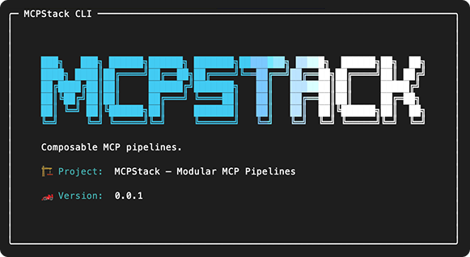
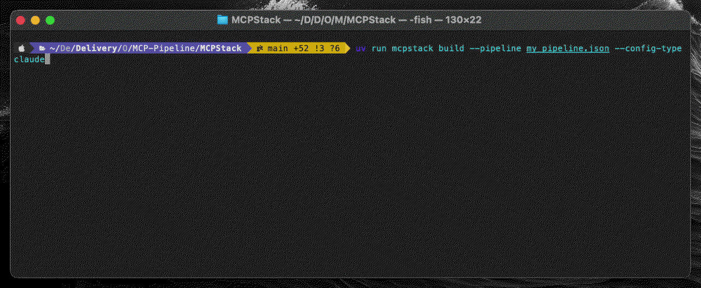
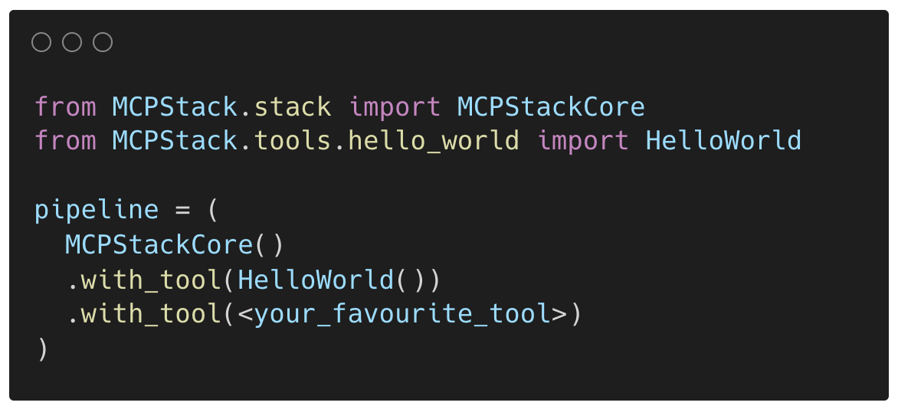
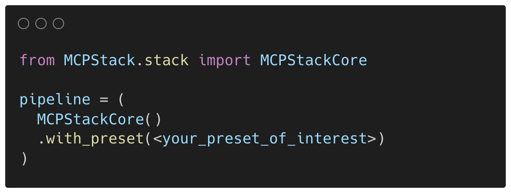
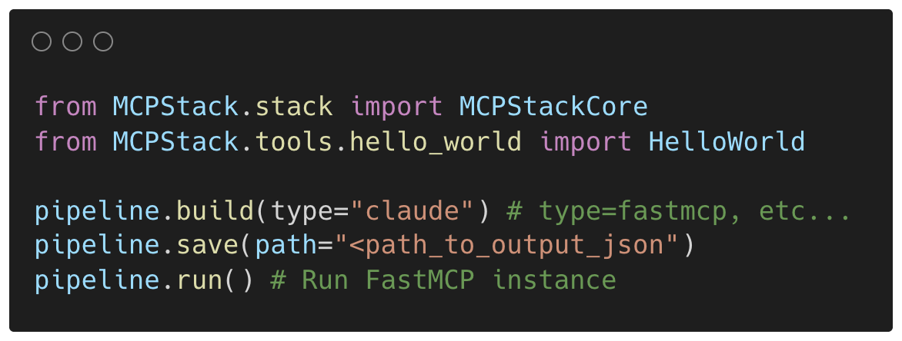
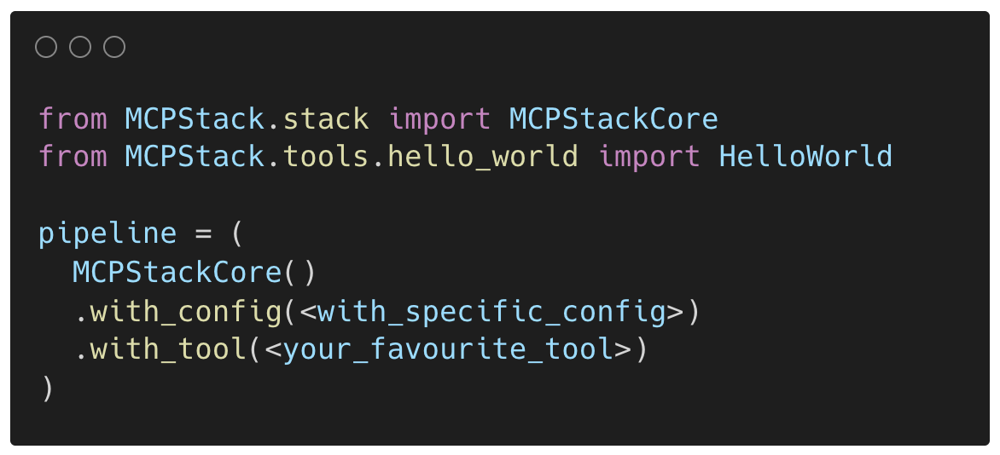
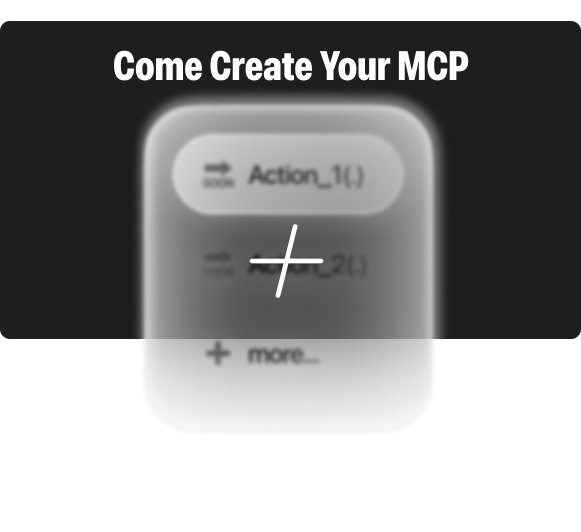

<!--suppress HtmlDeprecatedAttribute -->
<div align="center">
  <h1 align="center">
    MCPStack
    <br>
  </h1>
  <h4 align="center">Stack & Orchestrate MCP Tools — The Scikit-Learn-Pipeline Way, For LLMs</h4>
</div>

<div align="center">

<a href="https://pre-commit.com/">
  
</a>


<div align="center">
  <h1 align="center">
    <picture>
      <source media="(prefers-color-scheme: dark)" srcset="assets/COVER_dark.png">
      <source media="(prefers-color-scheme: light)" srcset="assets/COVER.png">
      
    </picture>
  </h1>
</div>

</div>

> [!IMPORTANT]
> * 📣Come Check Out Our MCPs Marketplace, on the documentation!
> * 🥇The Documentation is now available at [MCPStack Documentation](https://mcpstack.readthedocs.io/en/latest/).
> * 🎉 MCPStack MIMIC MCP tool, available!

## <a id="about-the-project"></a>💡 About The Project

`MCPStack` is a **`Scikit-Learn-Like` Pipeline orchestrator** for Model Context Protocols (MCPs).
It allows you to **stack multiple MCP tools together** into a pipeline of interest and expose them directly
into your favourite LLM environment, such as **Claude Desktop**.

Think of it as **`scikit-learn` pipelines, but for Large Language Models**:
* In `scikit-learn`, you chain `preprocessors`, `transformers`, and `estimators`.
* In `MCPStack`, you chain MCP tools of interest. If some tools are not of interest, you simply do not include them in the pipeline.

The LLM cannot use a tool that is not included in the pipeline.  This makes orchestration both **powerful** and **secure**.
This permits sophisticated compositions in which the LLM can only access the tools you specify – no more, no less.

**Wait, what is a Model Context Protocol (MCP) — In layman's terms ?**

The Model Context Protocol (MCP) standardises interactions with machine learning (Large Language) models,
enabling tools and libraries to communicate successfully with a uniform workflow.

---

## Installation

### Install dependencies

Using `UV` _(recommended, [see Astral UV official doc here](https://docs.astral.sh/uv/))_:

```bash
uv add mcpstack
```

Using `pip`:

```bash
pip install mcpstack
```

### Install pre-commit hooks

Via `UV`:

```bash
uv run pre-commit install
```

Via `pip`:

```bash
pre-commit install
```

> [!NOTE]
> MCPStack is the orchestrator — it comes with core utilities and validated tools.
> All MCPStack MCP tools are auto-registered via their `[project.entry-points."mcpstack.tools"]`.
> As such, simply add the tool(s) of interest via `UV` or `pip`, and it/they will be auto-registered.


## 🖥️ CLI Workflow

You can manage and run your MCP pipelines directly from the CLI with the `mcpstack` command.
Every command is run with `uv run mcpstack` (or just `mcpstack` if installed globally).



### `Help`

Display all available CLI options, from utilities to building your pipeline, run with `--help`.

<br clear="left">

<br />


### `Utilities`

List all validated tools available in your environment via `list-tools` and the presets via `list-presets`.
A preset is an already configured pipeline that you can run in one command line rather than building it from scratch.
Useful for experiments reproduction.

<br clear="right">

<br />


### `Your First Pipeline`

Create a pipeline from scratch with more than one MCPs in it! `pipeline <tool_name> --new/to-pipeline <json_output>`.

<br clear="left">

<br />


### `MCP Tool Configuration`

You can configure yoru MCP tools before adding it to your pipelines. `tools <tool_name> configure <flags avail/of interest>` then `pipeline <tool_name> --tool-config <path_to_configured_tool> ...`.

<br clear="right">

<br />



### `Run Pipeline In Claude`

As soon as you have built your pipeline, you can run it via many ways. One is within a LLM environment like Claude Desktop.
`build --pipeline <pipeline_path> --config-type <config_type_avail.>` — Open Claude Desktop now!

<br clear="left">

<br />


### `Run W/ FastMCP`

You can also run your pipeline with FastMCP, allowing you to connect to various LLMs avenues.

<br clear="right">

<br />

### `Docker Containerization` 🐳

Build and deploy your MCP pipelines as Docker containers for production environments.

#### Prerequisites
- **MCPStack**: `uv add mcpstack` or `pip install mcpstack`
- **Available Presets**: Check with `mcpstack list-presets` (assumes `example_preset` exists)
- **For full testing**: [Claude Desktop](https://claude.ai/desktop) for MCP server usage
- **For building images**: Docker CLI installed and available

#### Quick Start Commands

**Basic Config (Fastest setup)** ⭐ *Recommended for first-time users*
```bash
# Generate Docker config only - creates claude_desktop_config.json
mcpstack build --config-type docker --presets example_preset
```
*Outputs:* `claude_desktop_config.json` for MCP host configuration

**Development Workflow** 🛠️ *Recommended for local development*
```bash
# Generate config, dockerfile, and build image locally
mcpstack build --config-type docker --presets example_preset --profile build-only
```
*Outputs:* `claude_desktop_config.json` + `Dockerfile` + built image for local testing

**Production Pipeline** 🚀 *Recommended for deployment*
```bash
# Complete workflow: generate, build, and push container image
mcpstack build --config-type docker --presets example_preset --profile build-and-push
```
*Outputs:* Complete CI/CD pipeline with config, dockerfile, built & pushed container image

#### Verification Steps
```bash
# Check available profiles
mcpstack list-profiles --config-type docker

# After running any command, verify outputs:
ls -la claude_desktop_config.json Dockerfile  # Check generated files
docker images | grep mcpstack                    # Check built images
cat claude_desktop_config.json                  # Config for Claude Desktop
```

Perfect for deploying MCP tools to Kubernetes, Docker Swarm, or any container orchestration system.

<br />

### `Workflow Profiles` ⚙️

Define and run complex multi-stage workflows beyond basic config generation using workflow profiles.

#### Discover Available Profiles
```bash
# List all profiles
mcpstack list-profiles

# List profiles for specific config type
mcpstack list-profiles --config-type docker
```

#### Use Built-in Profiles
```bash
# Docker build and push workflow
mcpstack build --config-type docker --presets example_preset --profile build-and-push

# Docker build-only workflow (local development)
mcpstack build --config-type docker --presets example_preset --profile build-only
```

#### Custom Profile Examples
Check the `workflows/` directory for YAML examples:
- `docker-dev.yaml` - Development workflow with custom Dockerfile
- `docker-prod.yaml` - Production CI/CD pipeline with tagging and registry push

Profiles support environment variables like `${GIT_COMMIT}`, `${GIT_BRANCH}`, and `${preset}` for dynamic naming.

Perfect for implementing complex deployment pipelines while maintaining MCPStack's clean architecture.

<br />


### `Many Other CLIs Options`

More options are available, such as `search` for MCP tools or presets via a prompt query, run with presets,
search for MCP tools
help commands via `tools <tool_name> --help`, and more.

<br clear="left">

<br />

## ⚙️ Programmatic Workflow

For those wanted to integrate MCPStack into their Python workflow, or simply prefer
to play with programmatic pathways, MCPStack provides a Python API to build and run pipelines, very similarly;
with chaining-based methods for an intuitive and smooth programmatic API exp.



### `Your First Pipeline`

Build your first pipeline programmatically by stacking MCP tools together via `with_tool(.)` or `with_tools(...)` methods.
Of course, you can configure each tool before adding through `with_tool(.)`.

<br clear="left">

<br />



### `With Presets`

You can also use presets to build your pipeline, which is a pre-configured pipeline that you can run in one line of
code rather than stacking `with_tool(...)` methods. Great for experiments reproduction.

<br clear="right">

<br />



### `Build, Save, & Run!`

Once a pipeline's r eady, you can build, save and run it via many ways. `build(.)` preps your pipeline,
validate & prepare it for running. `Save(.)` pipeline to a file, and `run(.)` via FastMCP.

<br clear="left">

<br />



### `Many Other APIs`

More chaining methods are available, such as `with_config(...)` to configure the whole `MNCPStack` instance,
`with_tools(...)` which suppresses the need to call `with_tool(...)` multiple times, etc.

<br clear="left">

<br />



### `Create Your Tool`

You can also create your own MCP tool with the [`mcpstack-tool-builder` CLI](https://github.com/MCP-Pipeline/MCPStack-Tool-Builder), which will generate a skeleton for you to fill in.

That means, creating the `actions` your MCP tool will allow LLMs to perform, and a `CLI` to
initialise it, configure it, and run it. More in the documentation.

<br clear="left">

<br />

## 🔐 License

MIT — see **[LICENSE](LICENSE)**.
